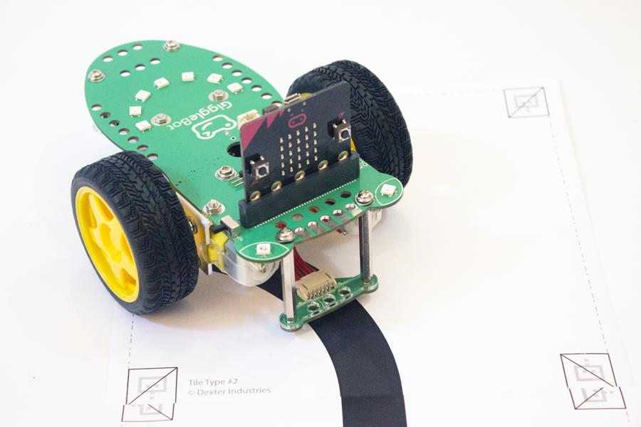

.. Gigglebot Micropython Library documentation master file, created by
   sphinx-quickstart on Tue Oct  2 19:46:02 2018.
   You can adapt this file completely to your liking, but it should at least
   contain the root `toctree` directive.

Welcome to the GiggleBot Micropython Library's documentation!
=============================================================

This library is meant to be used with the `Mu editor <https://codewith.mu/>`_ , a `Micro:bit <https://https://microbit.org/>`_, and `GiggleBot <https://gigglebot.io>`_.

For step by step installation instructions and how to get started, please see the main `GiggleBot website <https://www.gigglebot.io/pages/program-the-gigglebot-robot-micropython>`_

For an introduction to MicroPython on the Micro:Bit, see the `official tutorial <https://microbit-micropython.readthedocs.io/en/latest/index.html>`_.

.. toctree::
   :maxdepth: 2
   :caption: Contents:

   tutorial
   sensors
   code

Indices and tables
==================

* :ref:`genindex`
* :ref:`search`
